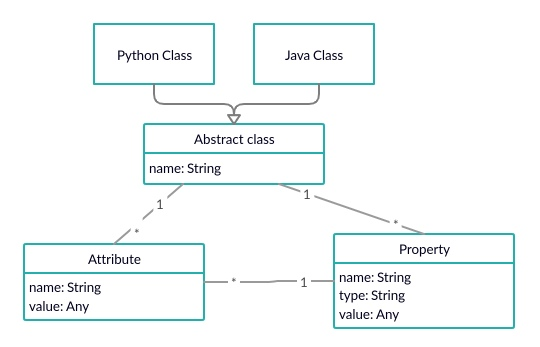

# GA2020
# Постановка задачи  
Реализовать язык описания классов, с возможностью задания различных аттрибутов.  

# Диаграмма использования  
  
# Метамодель языка  
  

# Установка
Для установки проекта необходимо следующее:
1. Склонировать/скачать репозиторий на локальную машину.
2. В репозитории присутствует файл `requirements.txt`, который нужно использовать для создания виртуального окружения.
3. С помощью PyCharm открыть директорию репозитория как проект.
4. В настройках PyCharm: `File -> Settings -> Project Interpreter` добавить новый интерпретатор, тем самым создав виртуального окружение. Его можно также создать через команду `virtualenv` (подробнее можно почитать тут: https://python-scripts.com/virtualenv)
5. В созданном виртуальном окружении прописать команду `pip install -r requirements.txt`
6. Запустить файл `main.py` с параметрами, указанными в описании этого файла

# Запуск
Для запуска проекта используются следующие аргументы командной строки:
* `--input-file` - полный путь до входного файла с описанием класса на нашем DSL (файл с расширением `*.dsc`).
* `--output-dir` - полный путь до директории, в которой будет создана поддиректория со сгенерированными классами на нужном языке.
* `--target-lan` - язык программирования, на котором необходимо сгенерировать исходный код (на данный момент поддерживается только `python`)

Необходимо запустить скрипт `main.py` с вышеуказанными аргументами.

# Пример описания класса на нашем DSL
```python
[json_serializable]
[category=staff]
class Person
{
  bool is_man
  int age
  str first_name
  str last_name
  bool money_is_not_a_problem

  string get_name()
}
```

# Пример результата кодо-генерации
Можно посмотреть в директории `examples\autogen\example_1`


# Планы на будущее
* Поддержать аттрибуты переменных
* Реализовать кодо-генерацию для языка программирования `Java`
* Доделать метамодель и диаграммы использования
* Собрать exe данного проекта
