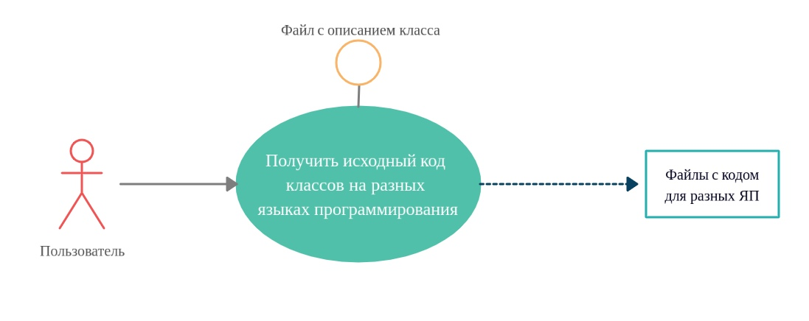
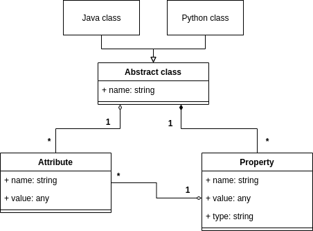

# ClassDesc
# Постановка задачи  
Реализовать язык описания классов, с возможностью задания различных аттрибутов.

ФАН: всегда нужен титульный лист с авторами, названием проекта, датой и статусом документа

# Диаграмма использования  
 

ФАН: Это НЕ диаграмма использования. Это блок-схема, показывающая алгоритм работы. Можно нарисовать в виде диаграммы деятельности или в виде диаграммы компонентов. Вообще говоря, примерно понятно, о чём речь, и если нарисовать корректную диаграмму трудно, то лучше написать словамии, что происходит. Такие картинки никому показывать нельзя - некоторые могут принять близко к сердцу и огорчиться.    

# Метамодель языка  
  

ФАН: очень ценная картинка для анализа сделанной работы. Сразу становится ясно, что главные вопросы не решены. Как я понял, идеей было построить генератор описания статических структур данных в различных языках программирования. Это неплохая идея. Но на диаграмме метамодели не указано, как входят свойства (и атрибуты) в класс: как агрегация, или как композиция? А это принципиальная информация для генерации описания класса! Если генерация в Java, то значение свойства - это ссылка на объект, а если генерация в Visual Basic, то свойства - это встраивание объекта! Боюсь, что весь круг вопросов о том, что описано на исходном азыке, как следует не продуман.  

Ответ: В данном реализации мы поддержали только возможность задания примитивных типов для полей класса. В случае таких языков, как java, python, c++ и т.д., включая все современные языки, примитивные типы всегда копируются, и не ссылаются на существующие вне класса объекты. Таким образом, после удаления самого класса его поля тоже очищаются, поэтому это между полями и классом отношение композиции.  
Аттрибут в нашем случае просто указывает на то, что данный класс или поле поддерживает какие-либо операции, например, его можно сохранить в формате json. Сам по себе аттрибут не уничтожится после уничтожения класса. Каждый аттрибут по сути статичен и существует набор аттрибутов, которые хранятся вне зависимости от класса. Поэтому при уничтожении класса аттрибуты не уничтожатся, следовательно между ними существует отношение агрегации.  

# Что было сделано
## Общий процесс работы
1. Парсинг файла с описанием класса, написанный на нашем DSL - файл с расширением `*.dsc`.

ФАН: это самое интересное в данном курсовике. Полагаю, что дело зашло ещё не очень далеко, и советую воспользоваться инструментом, который уже заработал у Александры Орищенко.  

2. Построение абстрактного класса по данным, полученным из парсинга.

ФАН: и что же это за данные, стесняюсь спросить?

3. Загрузка шаблонов, написанных на языке JINJA2.
4. Автоматическое заполнение шаблонов из абстрактного класса. 
5. Рендеринг шаблонов в выходные файлы.

## Реализованные аттрибуты
### Классовые аттрибуты 
1. `[json_serializable]` - аттрибут, добавляющий к классу методы сохранения экземпляра класса в формате `JSON`.
2. `[json_deserializable]` - аттрибут, добавляющий к классу методы загрузки значений переменных экземпляра класса из формата `JSON`.
3. `[category=<category_name>]` - аттрибут, добавляющий данный класс к определенной категории, по которой в дальнейшем можно будет сортировать/группировать экземпляры разных классов.

ФАН: атрибут с одним т :(

### Аттрибуты переменных
1. `[not_serializable]` - данным аттрибутом помечаются переменные, которые не будут участвовать в сохранении/загрузке экзмепляра класса из файла.
2. `[static]` - аттрибут, которым помечаются статические переменные класса.
3. `[const=<const_value>]` - аттрибут, которым помечаются константные переменные класса, с указанием самого значения.

ФАН: постоянные переменные :(

# Практическая применимость
На практике, наш DSL можно будет использовать для быстрой генерации исходного кода классов на определенном языке программирования, чтобы потом использовать его в своих целях. Также, по автоматически сгенерированному коду, новичкам в программировании можно будет посмотреть как правильно/желательно реализовывать разные структуры на разных ЯП.

ФАН: да, еще раз повторяю: в этой идее есть смысл, но необходимо устранить ошибки и недомолвки в деталях.

# Установка
Для установки проекта необходимо следующее:
1. Склонировать/скачать репозиторий на локальную машину.
2. В репозитории присутствует файл `requirements.txt`, который нужно использовать для создания виртуального окружения.
3. С помощью PyCharm открыть директорию репозитория как проект.
4. В настройках PyCharm: `File -> Settings -> Project Interpreter` добавить новый интерпретатор, тем самым создав виртуального окружение. Его можно также создать через команду `virtualenv` (подробнее можно почитать тут: https://python-scripts.com/virtualenv)
5. В созданном виртуальном окружении прописать команду `pip install -r requirements.txt`
6. Запустить файл `main.py` с параметрами, указанными в описании этого файла

# Запуск
Для запуска проекта используются следующие аргументы командной строки:
* `--input-file` - полный путь до входного файла с описанием класса на нашем DSL (файл с расширением `*.dsc`).
* `--output-dir` - полный путь до директории, в которой будет создана поддиректория со сгенерированными классами на нужном языке.
* `--target-lan` - язык программирования, на котором необходимо сгенерировать исходный код (на данный момент поддерживается только `python` и `java`)

Необходимо запустить скрипт `main.py` с вышеуказанными аргументами.

# Пример описания класса на нашем DSL
```python
[json_serializable]
[category=staff]
class Person
{
  [static]
  bool is_man
  
  [const=30]
  int age
  
  str first_name
  str last_name
  
  [not_serializable]
  bool money_is_not_a_problem

  str get_name()
}
```
ФАН: если bool is_money_not_a_problem, то станет смешнее. 

# Пример результата кодо-генерации
Можно посмотреть в директории `examples\autogen\example_1`
1. `examples\autogen\example_1\PYTHON_AUTOGEN` - директория, в которой лежит автосгенерированный код на языке `Python`. (Ссылка для быстрого доступа: https://github.com/sergeevgk/GA2020/tree/ClassDesc/examples/autogen/example_1/PYTHON_AUTOGEN).
2. `examples\autogen\example_1\JAVA_AUTOGEN` - директория, в которой лежит автосгенерированный код на языке `Java`. (Ссылка для быстрого доступа: https://github.com/sergeevgk/GA2020/tree/ClassDesc/examples/autogen/example_1/JAVA_AUTOGEN).

# Возможное развитие проекта
* Собрать `exe` данного проекта.
* Сделать плагины для `PyCharm` и `Intellij IDEA`, чтобы можно было удобно вызывать наш продукт прямо в среде разработки.

# Авторы
* Павел Денисов @Ppasha9 (pavelvan50@gmail.com)
* Туников Дмитрий @DmitriiTunikov (dima.tunikov@mail.ru)
